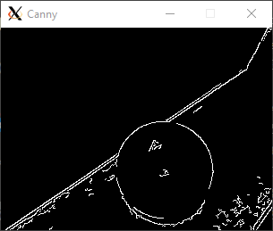
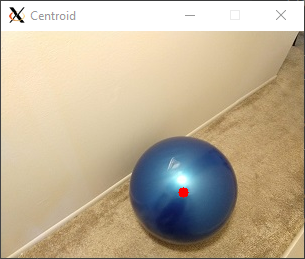
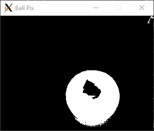

# Lab 1: Python Introduction

___
## Contents

* [Python: What is expected for this course](#python-what-is-expected-for-this-course)
* [Setup](#Setup)
* [Assignment](#Assignment)
* [Submitting this lab](#Submitting-this-lab) by *8am Tuesday September 14th, 2021.*
___
# Python: What is expected for this course

This class will involve programming robots to perform complex tasks, and so inevitably will require programming skills. Fortunately, advanced tools (namely ROS) and modern languages (such as Python) make this fairly straight forward. All the teaching examples will use Python, and it is expected that you can follow and program in Python yourself.

This assignment, like all assignments, must be performed on your own.  It assesses the topics covered by the [Python Introduction Notes](https://github.com/dmorris0/python_intro/blob/main/README.md).  Its goal is to ensure that you are familiar with the basics of Python so that you can follow lecture examples, and that you have a working Python environment.  For this assignment you can use either the ROS VM Remote Desktop environment, or any other Python 3.8 or later environment.  

This assignment should not be hard, although may be a fair bit of work.  Feel free to use online documentation and web searches.  If you are unable to get a high score in this assignment, then you are strongly recommended to take a programming class before taking this course. 

A final note: try and make your code clean and succinct.  

# Setup

1. Create a your own respository on Gitlab as explained in the [labs_2021/README.md](../README.md) and give permissions to the instructors and clone it onto your computer.  I'll refer to this as `<student_repo>`
2. Clone the the lab assignment repo [https://gitlab.msu.edu/labs/labs_2021](https://gitlab.msu.edu/labs/labs_2021) onto your computer.
3. Copy the `labs1_python` folder and its contents into the `<student_repo>`.  

You will now have a your assignment in your submission repo.

# Assignment

This lab comes with 
* 2 python files: [src/lab1_review.py](src/lab1_review.py) and [src/lab1_student_score.py](src/lab1_score.py)
* A sample image: [data/ball.jpg](data/ball.jpg)
* Ground truth results in folder [gt](gt)

The functions in `lab1_review.py` are incomplete, but their inputs and outputs are specified.  **Your task is to complete all 20 of these functions.**  

The `lab1_student_score.py` function is provided as a means for you to score your work.  You can score your functions with:
```python
python lab1_score.py
```
The output will tell you how many errors or failures there are.  When there are no failures, then likely you have got everything right -- I say likely because those are not exhaustive tests, and the grader may use different tests.  But if your functions follow the directions then you should be good.

Additionally, when you have completed everything correctly, you should see three windows like this:
<p align="left">



</p>

## Debugging
I highly recommend that you test the VSCode debugger on this assignment, as being able to do this for later projects will be very useful. 

# Submitting this lab
Your code should all be inside the `<student_repo>/lab1_python` folder.  To submit do:
```
cd <student_repo>/lab1_python
git add .
git commit -m "Add a comment here"
git push
```
Do not forget to `push`, or your lab will not be submitted.

It is due: *8am Tuesday September 14th, 2021.*
___