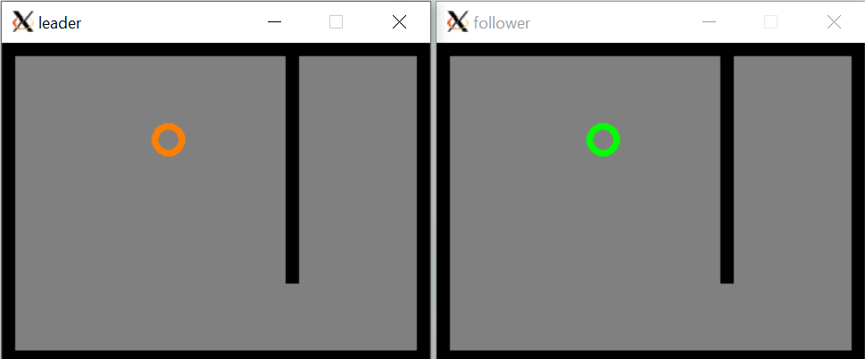

# Lab 2 - Robot Operating System (ROS) Basics
## ECE-CSE 434 - Automated Vehicles
## Contents
* [Background](#Background)
* [Assignment Preparation](#Assignment-Preparation)
* [Exercise 1: Obstacle Detector](#Exercise-1-Obstacle-Detector)
* [Exercise 2: Follow the Leader](#Exercise-2-Follow-the-Leader)


# Background

Before starting this lab, complete the following:

1. Complete the **Setup** section of [AV Notes](https://gitlab.msu.edu/av/av_notes)   You should be comfortable:
    * Editing and debugging Python code that includes OpenCV.  
    * Able to create a ROS package, write a Python node and run it.
3. Complete the **Start ROS** and **ROS Messaging** sections of [AV Notes](https://gitlab.msu.edu/av/av_notes).  You should be comfortable:
    * Playing a ROS bag, displaying the topics, and plotting the Lidar points in RViz.  

If you wish to dive deeper into ROS details, you can step through some of the tutorials ([http://wiki.ros.org/ROS/Tutorials](http://wiki.ros.org/ROS/Tutorials)) maintained by the Open Source Robotics Foundation (OSRF). 


# Assignment Preparation

Lab 2 and onwards will consist of creating a ROS package and pushing it to your Gitlab repository which here will be called `<student_repo>`. The package should have the same name as the assigned lab. So, for lab 2 you should do the following.  If you have not already, clone your repo in your `catkin_ws/src` folder:
```bash
source ~/catkin_ws/devel/setup.bash
cd ~/catkin_ws/src
git clone <student_repo>
```
Next, within this repo create your `lab2_nodes` package:
```
cd ~/catkin_ws/src/<student_repo>
catkin_create_pkg lab2_nodes rospy
```
All your code for this assignment should be in this folder:
````
~/catkin_ws/src/<student_repo>/lab2_nodes/src
````
Start by copying all the files in `lab2_nodes/src/` to the above folder.

When you are ready to submit this assignment, add, commit and push your code as you did in lab 1.  

# Lab Rosbags

The rosbags for this lab and future labs are available here: [https://drive.google.com/drive/folders/1Tx0CzG8srHAS2AYjCCD9ftkC6SUtlfRp?usp=sharing](https://drive.google.com/drive/folders/1Tx0CzG8srHAS2AYjCCD9ftkC6SUtlfRp?usp=sharing)  Download and copy them into a folder in your Ubuntu environment; I recommend creating and putting them in a folder in your home folder called `~/bags`.  There is no need for the bag files to be in the same folder as your code, as you will be playing them with the `rosbag play` command.  Note: do **not** add and push bag files to your git repo.  They are large and will use up the instructor bandwidth when pulling your repo, and may result in a point deduction.  To be safe it is best to keep them outside your git repo, but if you put a bag file in your repo, then add `*.bag` to the repo's `.gitignore` file to ensure bag files are not added and pushed.

# Exercise 1: Obstacle Detector

As usual, before you can run any ROS commands, you need the ROS master process running.  So in one terminal run:
```
roscore
```
This exercise will use the same rosbag called `msu_sv_short.bag` explored in the AV Notes ROS introduction.   Assumimg you have put the bag files in `~/bags`, play your bag with:
```
rosbag play --loop --clock ~/bags/msu_sv_short.bag
```
Before running `rviz`, make sure it uses the bag time rather than the current time with the command:
```
rosparam set /use_sim_time true
```
Then run
```
rviz
```
Make sure you can see the lidar points adjusting the settings as explained in `AV Notes / ROS / Messaging.md`.  

Imagine our vehicle can drive over curbs and off-road, but not through trees, poles or walls. Make a simple obstacle-detector that finds lidar pixels on all of these non-traversable regions within 20 meters of the lidar. Here you assume that the height of the lidar is **1.6m above the ground**.  Node specifications:
* The code for your node has been started for you and is called: `obs_detect.py`.  (You copied this into your package above)
* As you'll notice, your node subscribes to `/points_raw` to read points from the lidar (or played back from the bag).
* Your node should detect all obstacle pixels.  A point is an obstacle if all three of these are satisfied:
  * Its height is > 0.25m above ground _and_ 
  * Its height is < 2.0m above ground _and_ 
  * Its distance from the lidar is < 20m
* Your node must publish the **obstacle** lidar pixels as a PointCloud2 message type in a new topic named `points_obs`.

Lidar-pixel height-above-ground can be a useful cue for this; think about how to calculate 
height-above-ground from the data (whose origin is the lidar).  If you have followed the instructions, your code should run with the following command:
```bash
rosrun lab2_nodes obs_detect.py
```
If tab complete does not work or the node does not run then ensure that roscore is running, the overlay is sourced and that that `obs_detect.py` is executable.  

Once your code is running and publishing filtered data from the rosbag, in Rviz select topic `points_obs` for the PointCloud2 topic and visually confirm that you are getting expected points around the vehicle.

# Exercise 2: Follow the Leader

Consider this scenario.   In room-A there is robot-A that you can command to move around.  In an identical room-B there is another robot-B that attempts to copy the motion of robot-A.  This assignment will create a simulation of this with ROS and OpenCV.  Remember from the [Python documentation](https://gitlab.msu.edu/av/av_notes/-/blob/master/Setup/Python_Environment.md#OpenCV) that OpenCV is not thread safe.  To get you going, you are provided with three Python files that are partially complete.  These files and descriptions are:
 * `robot_room.py`: This is a utility class that takes care of drawing a room, drawing a robot, listening to the keyboard for commands, and moving the robot based on commands and its room location. 
 * `leader.py`: This is a ROS node that defines room-A and robot-A.  Robot-A is controlled by the keyboard.  Additionally the motion commands are published to a `robot_move` topic so other nodes can follow.  
 * `follower.py`: This is a ROS node that subscribes to `robot_move` and moves the robot according to the commands it reads from this.  It should be an anonymous node to enable multiple simultaneous subscribers.

Both `leader.py` and `follower.py` import `robot_room.py` and use its functions.

Your task is to add these Python files to your `lab2_nodes` package, and finish the uncompleted portions so that you achieve the target behavior.  The grader should be able to run this lab with the following commands in two separate terminals:
```bash
rosrun lab2_nodes leader.py
```
and
```bash
rosrun lab2_nodes follower.py
```
Of course, do not forget that `roscore` must be running in a separate shell.  Here is what the leader and follower windows may like like:



Click on the **leader** window and use the indicated keys to direct the robot to move around.  OpenCV will only read in the keyboard keys if the graphical window is selected.

In another terminal try running an additional follower.  You should be able to run any number of followers.  This illustrates how the publisher does not care which or how many nodes are subscribed, and the subscribers do not care who is doing the publishing, only what is published in the topic. 

Note: For grading purposes, please name the leader node `leader` and have it publish to two int32 topics, `leader_x` and `leader_y`, to represent its position. Also publish the same for the follower nodes: `follower_x` and `follower_y`.

