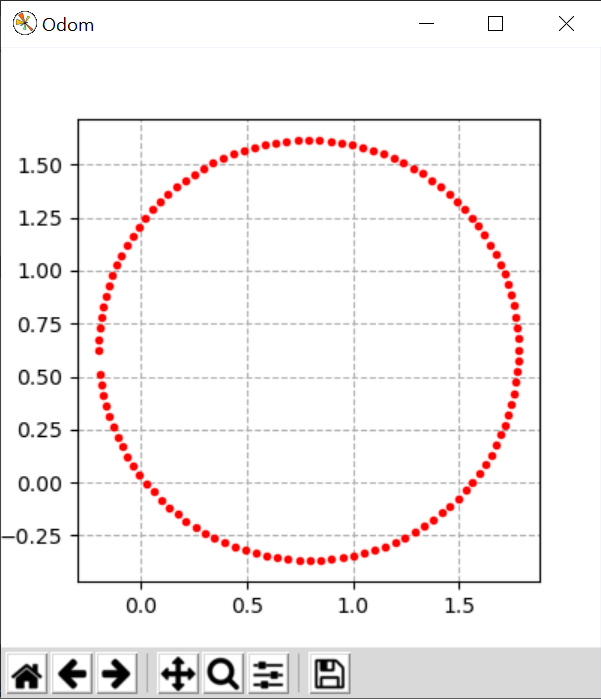

# Lab Assignment 3 - Turtlebot Navigation
## ECE-CSE 491/434 - Automated Vehicles

# Prerequisites

Before starting this lab read and try out the examples in the **Turtlebots and Gazebo** section of [AV Notes](https://gitlab.msu.edu/av/av_notes).  You should be comfortable running a Gazebo instance with a Turtlebot, and publishing a `/cmd_vel` topic to get the Turtlebot to drive in a circle.

The nodes in this lab will operate a Turtlebot in the Gazebo simulator.  To start Gazebo, open a shell, source the **overlay**, (since the Turtlebot simulations are installed in your catkin workspace), and run:
```
roslaunch turtlebot3_gazebo turtlebot3_empty_world.launch
```
If you have difficulty with this, see the Trouble Shooting document in AV Nodes.  As the AV Notes explain, `roslaunch` automatically calls `roscore` if it is not already called.  You will need to leave this running while you complete the exercises.

# Assignment Preparation

Lab 3 will explore writing nodes to control the Turtlebot.  As in lab 2, you should create a ROS package for this lab and push it to your git repo before the due date.  You should already have cloned your lab repo to: `~/catkin_ws/src/<student_repo>`.  Now create a ROS package for lab 3 as follows:
```bash
source ~/catkin_ws/devel/setup.bash
cd ~/catkin_ws/src/<student_repo>
catkin_create_pkg lab3_nav rospy
```
Then you will put the code for any nodes you create in this folder:
````
~/catkin_ws/src/<student_repo>/lab3_nav/src
````
When you have completed this assignment, add, commit and push your code to Gitlab. 

# Exercise 1: Bot Monitor

The goal of this assignment is to create a Turtlebot driving monitor.  It should plot the trajectory that the Turtlebot takes in an `x-y` axes plot updating its points in realtime with a final result something like this for circle driving:



If you do a `rostopic list`, you may notice that the Turtlebot is publishing a topic called `/odom`.  This is the robot's fused odometry estimate, and from this you can find the location of the Turtlebot.  You can find some information about `/odom` using `rostopic info /odom`, but it is probably easier to use the Topic Monitor in `rqt`.  Determine which portion of `/odom` you need.  Then write a node called `bot_monitor.py` that subscribes to `/odom` and plots the location of the Turtlebot *updated in real time* in a window.  Your code should run with:  
```bash
rosrun lab3_nav bot_monitor.py
```
In order to test this bot monitor, copy the `circle_drive.py` code from `av_notes/ROS/python/circle_drive.py` into the `lab3_nav/src` folder.  Then run it with:
```bash
rosrun lab3_nav circle_drive.py
```
Your bot monitor node should display the Turtlebot trajectory similar to the illustration above.  Note: for the sake of memory and computation, it is a good idea *not to plot every point from /odom*, but rather only plot points if they differ by a minimum displacement from the previous plotted point.  

## Hints:
* I recommend using Matplotlib, which has plenty of online documentation and examples: [https://matplotlib.org/](https://matplotlib.org/)
* When you initialize a plot, you may wish to set some plot characteristics like this:
```
    plt.grid(True, linestyle='--')
    plt.gca().set_aspect('equal', 'box')
```
* In order to refresh the plot in real time, I recommend that after plotting each point, you call the following:
```python
    plt.gcf().canvas.flush_events()
    plt.show(block=False)
    plt.show(block=False)  # calling this twice is sometimes needed
```

# Exercise 2: Drive in a Square at Constant Speed

The goal of this assignment is to write a node that will drive the Turtlebot at *constant linear speed* in an approximate square.  If it is travelling at constant speed it cannot drive in an exact square as it cannot turn instantaneously at the corners, thus it will need to cut the corners in order to avoid slowing down.  The target square in (x,y) coordinates connects (0,0) to (1,0) to (1,1) to (0,1) and back to (0,0), with units in meters.   The Turtlebot run will last 20 seconds maximum or until the last waypoint is reached (i.e. return to start).  Keep the Turtlebot going at constant speed throughout, as there is a penalty deduction for changing speed before completion (so you may wish to not stop the Turtlebot at the end in case it misses the target).

We provide a node called `test_square.py` that lays down a set of 24 waypoints and measures how many the Turtlebot achieves, and resets the Turtlebot when done.  Achieving a waypoint requires passing within 0.1m of it.  The grader will use this same function to evaluate your node, so you can use it to pre-evaluate your performance.  You are free to use your `bot_monitor.py` from Exercise 1 to observe the track of your Turtlebot and refine its trajectory. Note that this exercise should be solved **open loop** without feedback; that is, your node is not permitted to subscribe to any sensor data, especially not `/odom`.

Make sure Gazebo is running, as described above.  

Your node should be called `square_drive.py`, and you can call your code in three terminals with:
```bash
rosrun lab3_nav bot_monitor.py
```
```bash
rosrun lab3_nav test_square.py
```
```bash
rosrun lab3_nav square_drive.py
```

*Note*: You may see the following error:
```
rospy.exceptions.ROSTimeMovedBackwardsException: ROS time moved backwards
```
This happens if your nodes gives ROS commands after the Turtlebot world is reset (by `test_square.py`).  Avoid this by simply ending your node when it has completed the course or published its final velocity command.

## Scoring for Exercise 2 (out of 10 points):
The scoring is done by the grader running your code and based on the output of `test_square.py`.  What matters is what the grader gets when running your code, not what you get.  You'll notice that there is variation of the Turtlebot's trajectory each time it runs.
* 4 points for your node running and moving the Turtlebot forward at least 0.25m
* 0.25 points for each waypoint reached, up to a maximum of 5 points (i.e. need to reach 20 of 24 waypoints for full credit)
* 0.5 points if your robot completes (reaches last waypoint) in under 15 seconds
* 0.5 points if your robot completes (reaches last waypoint) in under 10 seconds
* -2 points if max speed - min speed > 0.1 m/s
* -6 points if node subscribes to sensor data
