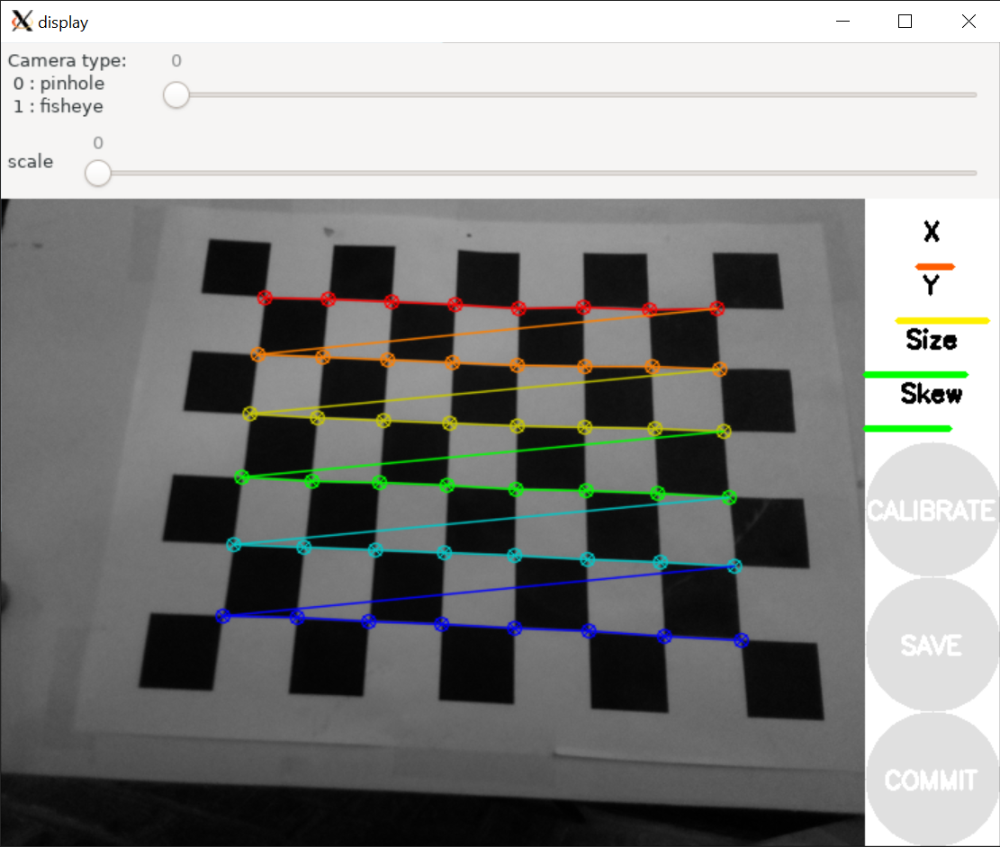
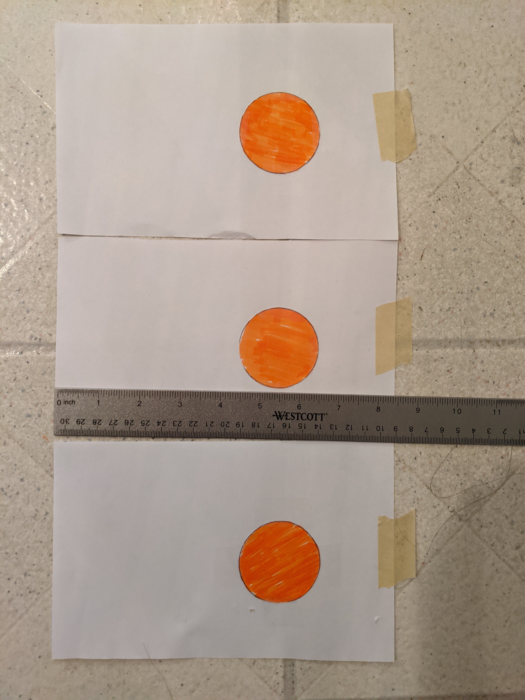
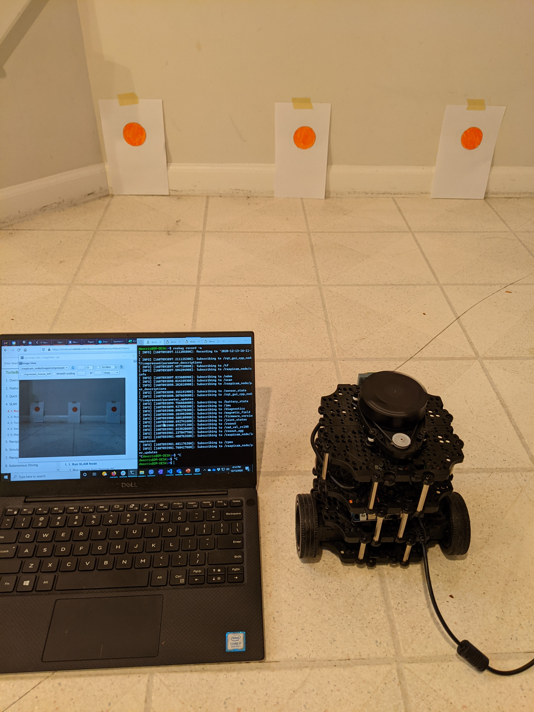
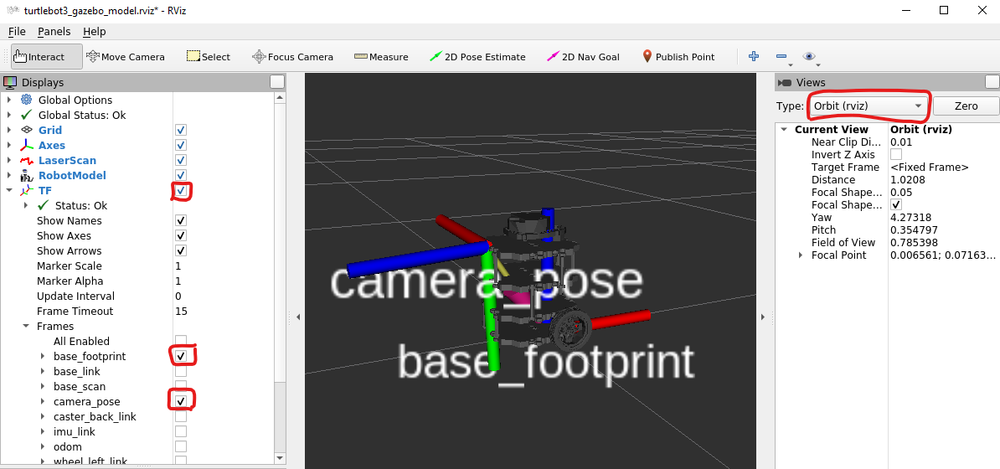
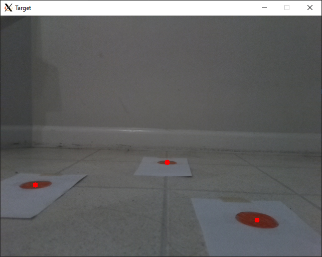
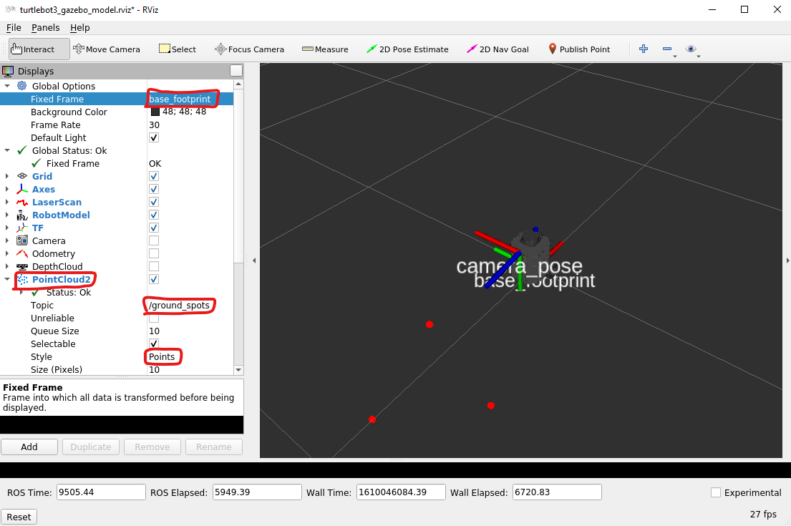

# Lab 5: Camera Calibration
## ECE-CSE 434 - Autonomous Vehicles


# Introduction
This lab will explore both intrinsic and extrinsic calibration of the Turtlebot camera.  By calibrating a camera one turns images into powerful measurements of the 3D environment.  

**Intrinsic calibration** provides a model by which each pixel specifies the direction of a ray from the camera's optical center into the world.  So, for instance, if you know the depth of an object along a pixel ray, you can infer exactly the 3D location of the object relative to the camera.  

**Extrinsic calibration** specifies the pose (i.e. location and orientation) of a sensor.  For the Turtlebot, we are interested in the pose of the camera relative to the base of the Turtlebot.  Then if we can determine the location of an object relative to the camera (using its intrinsics), we can also infer its location relative to the Turtlebot.

# Preparation

## Download a bug fix

Right now there is a bug in the ROS camera calibration code in the latest ROS Noetic release that prevents you saving your calibration parameters.  It has been corrected in the source code but not the released version.  To obtain the corrected package source code and use it, build it from source with the following:
```bash 
$ source ~/catkin_ws/devel/setup.bash
$ cd ~/catkin_ws/src
$ git clone https://github.com/ros-perception/image_pipeline.git
$ cd ..
$ catkin_make
```
As long as you source your **overlay**, this package will take precedence over the `image_pipeline` package in `/opt/ros/noetic/`, and your intrinsic calibration software should work.

## Download Calibration Data

Since this year's class is remote, rather than collecting calibration on the Turtlebots yourselves, this has been done and stored in rosbags.  You can still do the calibration just like you would with the real robot, but by playing back pre-recorded rosbags.  The bags are in the same location as in Lab 4, and I recommend you download them to a folder called `~/bags`.

In this lab we will be using these bags: `intrinsic_cali.bag`, `dot_three_wall.bag` and `dot_ground.bag`.

# ROS Package
This lab assumes you have cloned your student repo into your catkin workspace as explained in lab 2.  Within this repo create your `lab5_calib` package:
```bash
$ cd ~/catkin_ws/src/<student_repo>
$ catkin_create_pkg lab5_calib rospy
```
Start by copying everything in the assignment lab folder to this folder:
```bash
$ cp -r <path_to_repo>/labs_2021/lab5_calib/ ~/catkin_ws/src/<student_repo>/lab5_calib/
```
where you should insert the appropriate paths for `<path_to_repo>` and `<student_repo>`.

## View the Bags

The Turtlebot3 only publishes images in `CompressedImage` type.  These can be viewed by `rqt_image_viewer`, but cannot be read by the calibration routine.  To convert these in realtime to raw `Image` type, run an `image_transport` node on the local machine with the following command:
```bash
$ rosrun image_transport republish compressed in:=/raspicam_node/image raw out:=/camera/image_raw
```
This decompresses the image from topic `/raspicam_node/image` and republishes it to topic `/camera/image_raw`. Finally, play your bag once (i.e. **not** using the `--loop` option) using: 
```bash
$ rosbag play ~/bags/intrinsic_cali.bag
```
And in a separate shell view it with:
```bash
$ rqt_image_view
```
Notice that you can view both the compressed image topic and the raw image topic by selecting them like this:


# Exercise 1: Intrinsic Calibrtion

If you can see the checkerboard in being published in the `intrinsic_cali.bag` file, you are ready to do intrinsic calibration.  The following is the ROS calibration package you can use for this:
```bash
$ rosrun camera_calibration cameracalibrator.py --size 8x6 --square 0.026 image:=/camera/image_raw camera:=/raspicam_node --no-service-check
```
Here the arguments are:

**`--size (w-1)x(h-1)`** where the checkerboard has w horizontal and h vertical squares, respectively.

**`--square 0.026`** the side of a checkerboard square is 0.026 meters.  For intrinsic this does not matter.

**`--no-service-check`** is just because we are playing a rosbag, and will not be able to call a ROS service to set the `camera_info` on the Turtlebot.

It can be tricky and tedious play the rosbag, run the image_transport node and run the camera calibration node *all simultaneously* in separate shells.  A much easier solution is to put all of these commands together into a single launch file.  I have provide a launch file to do this called `do_intrinsic_cali.launch`.  Open it in an editor and confirm that it launches all three of these.  There is one change you may need to make.  A launch file will not search in the current folder for the `intrinsic_cali.bag` file, and rather uses an absolute path to the bag file.  If you put your bag file in your `~/bags` folder, then the launch file will find it as-is, otherwise adjust the launch file to find your bag file.

Once ready, you can run the launch file with:
```bash
$ roslaunch lab5_calib do_intrinsic_cali.launch
```
You should see the corner detector displaying the detected checkerboard pattern on the video like this:



Once it has detected a sufficient number of checkerboard orientations, the grayed-out `CALIBRATE` circle will turn green.  You can click on this at any point (or wait for the rosbag to complete playing).  This will perform calibration (and may take a minute or two).  Once done the remaining two circles will be highlighted.  The `COMMIT` option will not work as the Turtlebot is not connected.  The `SAVE` option will save the calibration parameters to: `/tmp/calibrationdata.tar.gz`.  You can extract the contents of this file with:
```bash 
$ tar -xzf /tmp/calibrationdata.tar.gz
```
You can delete the extracted images called `left-XXXX.png`.  The files `ost.yaml` and `ost.txt` contain the intrinsic calibration parameters.

If you had access to the Turtlebot on which this bag was collected, you could copy this file to the following Turtlebot location so that it will be published in the `camera_info` topic:
```
~/catkin_ws/src/turtlebot3/turtlebot3_bringup/camera_info/turtlebot3_rpicamera.yaml
```
Instead, copy the `ost.yaml` file into your `lab5_calib` folder.  Using the information in this file, create a text file called `camparams.txt` in your `lab5_calib` folder with the following text and fill in the missing value after each colon (keeping at least one space between the colon and the value):
```
x focal length:       units:
y focal length:       units:
x optical center:     units:
y optical center:     units:
Radial distortion parameters       k1:     k2:     k3:
Tangential distortion parameters   p1:     p2:  
```

# Exercise 2: Using intrinsics

Once you have camera intrinsics, you can transform pixel locations to rays.  That is, given coordinates of a pixel, you can find the 3D ray that starts at the camera optical center and passes through that pixel.  In this exercise you will create a transform node that will convert pixel coordinates to 3D rays.  

Recall in Lab 4 we wrote a node to publish target centroids to the `/dots` topic.  Write a node called `pixel_rays.py` that subscribes to `/dots` and converts the array of points in `/dots` to an array of 3D rays in camera coordinates and publishes them to a topic called `/rays`.  Just like the `/dots` topic, `/rays` should be of type `Point32Array`, and each message should copy the header timestamp from the `/dots` message it corresponds to, and change the header `frame_id` from `camera` to `camera_pose`.  This node will thus be a transformer of pixel coordinates to 3D rays in `camera_pose` coordinates.

Your node will need the camera intrinsics.  For this exercise use the intrinsics published in `/raspicam_node/camera_info`.  Since these parameters are fixed, you can read them once (after node initialization) with the following commands:
```python
from sensor_msgs.msg import CameraInfo

cam_msg = rospy.wait_for_message('/raspicam_node/camera_info', CameraInfo)
```

For the actual transformation work, I recommend the function `cv2.undistortPoints(pts_distort, K, D, R=None, P=None)`, where you can pass in points in pixel coordinates as well as the intrinsic parameters.  This will output points in the unit focal plane, which are straight forward to convert into 3D rays in `camera_pose` coordinates.

*Hint:* A somewhat tricky part of this exercise is to ensure all your arguments are correctly-shaped numpy arrays.  Here is what I did:
```python
D = np.array(cam_msg.D)
K = np.array(cam_msg.K).reshape( (3,3) )
```

When you are done, you can run the following commands in separate shells:
```bash
$ rosbag play --loop ~/bags/dot_three_wall.bag
$ roslaunch lab4_color dot_detect.launch
$ rosrun lab5_calib pixel_rays.py
```
Confirm that the centroids of the three marks on the wall are detected and that the `/rays` topic is being published at the same rate as the `/dots` topic.

# Exercise 3: Extrinsic calibration

The goal of this assignment is to do extrinsic calibration using the 3-horizontal-point method described in class.  The setup is summarized in 3 images, where the three wall-marks are at the same height as the camera and the center mark is along the negative `x` axis of the robot.
<p align="middle">
 &nbsp;&nbsp;
 &nbsp;&nbsp;

</p>


1. Implement extrinsic calibration using the three horizontal dots  as described in the lecture.  Run the three commands at the end of Exercise 2 to play the rosbag with these three dots on a wall, and publish the rays to them in topic `/rays`.  Create a node called `calc_rot.py` that subscribes to `/rays` and calculates the rotation of the camera in `base_footprint` coordinates.  (In lecture notes this is *R* with a *m* left superscript and a *c* left subscript.)  Once your code finds this rotation matrix, convert it to a quaternion and output the quaternion as a 4-element list to a ROS parameter called `/cam_rot`.  Your code should run with
```bash
$ rosrun lab5_calib calc_rot.py
```
The purpose of setting the ROS parameter is to enable grading your result using the command:
```bash
$ rosparam get cam_rot
```
Once you have copied down this rotation, you can quit all the running nodes and stop playing the bag file.

### *Hints for Ex 3:*
* Numpy can do cross products, `numpy.cross()`, and vector normalization, `numpy.linalg.norm()`.  See examples in: [AV / ROS / Coordinate Transforms](https://gitlab.msu.edu/av/av_notes/-/blob/master/ROS/Coordinate_Transforms.md#vector-manipulation-with-numpy)
* A convenient way to transform between rotation matrices and quaternions is using the Scipy transform toolkit.  An example is here: https://docs.scipy.org/doc/scipy/reference/generated/scipy.spatial.transform.Rotation.as_quat.html.
* The parameter setter, `rospy.set_param()`, requires a list containing `float`, not `numpy.float64` elements.  This can be obtained with `numpy.tolist()`.  
* There are many opportunities for bugs in calculating transformations, and it is important to sanity check your work.  I recommend printing out all the following:
  * `mx`, `my`, `mz`
  * `R` (the rotation matrix)
  * `quaternion` (from your rotation)
* Think about what you expect `mx`, `my` and `mz` to be (approximately) in camera coordinates, and confirm that they are correct.  
* Finally, make sure the axes as displayed by Rviz (see below) are roughly correct (x is red, y is green and z is blue).

2. Create a launch file that publishes the extrinsic calibration of the robot called `pub_extrinsic_cali.launch` and put it in the `lab5_calib/launch` folder.  It should call the ROS package `tf2_ros`, the node `static_transform_publisher` and provide it the following arguments: `tx ty tz q1 q2 q3 q4 base_footprint camera_pose`.  Here `tx ty tz` is the position of `camera_pose` relative to `base_footprint` in `base_footprint` coordinates, and its measured values are: `-0.1 0. 0.15` (meters).  The rotation quaternion, `q1 q2 q3 q4`, is what you calculated in exercise 1: the rotation of the camera relative to `base_footprint`.  You can then publish the camera pose with:
```bash
$ roslaunch lab5_calib pub_extrinsic_cali.launch
```
Let's sanity check this transform.  To confirm that it is being published and its parent is `base_footprint`, run:
```bash
$ rosrun rqt_tf_tree rqt_tf_tree
```
Then quit this and start a Turtlebot in Gazebo and Rviz.  In two separate shells run:
```bash
$ roslaunch turtlebot3_gazebo turtlebot3_empty_world.launch
$ roslaunch turtlebot3_gazebo turtlebot3_gazebo_rviz.launch
```
In Rviz, adjust the view type in the view panel to *orbit* and zoom in.  Select the `base_footprint` and `camera_pose` transforms on the left panel, and you should see an output like the below with the `camera_pose` coordinates correctly oriented on the rear of the turtlebot.




# Exercise 4: Using Extrinsics

Our goal is to find the location of targets on the ground relative to the robot, such as you will find in the ros bag: `dot_ground.bag`.  To play this bag and detect ground targets, run the following commands in separate shells:
```bash
$ rosbag play --loop ~/bags/dot_ground.bag
$ roslaunch lab4_color dot_detect.launch
$ rosrun lab5_calib pixel_rays.py
```
You should see image output like this with the detected spots:



Now complete the code in `ground_spots.py` that subscribes to `/rays` and for each ray, calculates the location where it intersects the ground.  It should then publish these 3D points, relative to `base_footprint`, in a topic called `/ground_spots` as a `PointCloud2` array.  You'll run your code with:
```bash
$ rosrun lab5_calib ground_spots.py
```
Then run gazebo and Rviz like you did for Exercise 3, and open `/ground_spots` as a `PointCloud2` topic and display them as marks.  You should see them on the ground around the Turtlebot like this:



Notice a few things: 
* Under Global Options the frame is `base_footprint`. 
* A PointCloud2 was added and topic `/ground_spots` was selected.
* The centroids on the ground appear roughly correct.  Part of your score will depend on accurately estimating these locations.
___
# Checklist to submit
`lab5_calib` ROS project containing:
* Ex 1: `ost.yaml` and `camparams.txt` files
* Ex 2: `pixel_rays.py`
* Ex 3: `calc_rot.py` that sets `/cam_rot` params.  
  * Also `pub_extrinsic_cali.launch` file that publishes a static transform.
* Ex 4: `ground_spots.py` that publishes a PointCloud2 to `/ground_spots` topic

As usual, commit and push all these to your individual lab repo.


