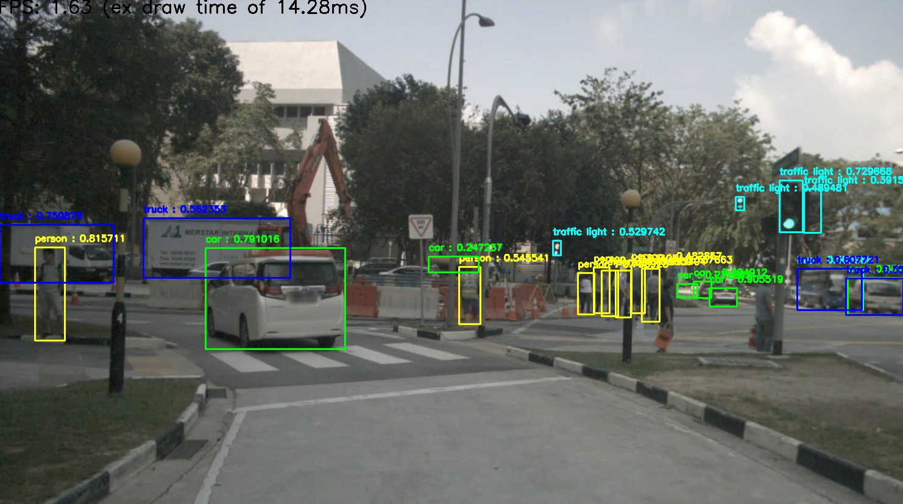

# Lab Assignment 6: A ROS Node Running a Deep Neural Network
## ECE-CSE 491/434 - Autonomous Vehicles

# Introduction

The goal of this lab is to create a ROS Node that runs a deep neural network (DNN) to do object detection on images published by a vehicle-mounted camera.  We will use a state-of-the-art method called YOLOv4.  

A current limitation on running DNNs is that WSL does not support GPU operations, so we will need to run it using the CPU, and as a result will obtain fairly slow detection performance.  However, if you have Ubuntu running straight on a GPU machine, the performance of the detector in this lab should be close to real-time without any changes.

## Setup
### Install OpenCV 4.5
We will be using OpenCV to run the DNN.  It turns out that YOLOv4 uses functions not available in OpenCV 4.2 (being used in ROS), so we need to install the latest version 4.5.  According to this [page](https://pypi.org/project/opencv-python/), one should uninstall any previous versions of OpenCV, but we don't want to do that, as it is installed in ROS.  So instead, I recommend create a new Virtual Environment called `cv4' to use for this lab with OpenCV 4.5 as follows:
```bash
$ python3 -m venv --system-site-packages ~/envs/cv4
```
Then activate this environment and install the latest OpenCV in it:
```bash
$ source ~/envs/cv4/bin/activate
$ python -m pip install opencv-python
```
For this lab we'll be using this new `(cv4)` environment.
### Download Pre-Trained Weights
Next download YOLOv4's configuration file and pre-trained weights from the YOLOv4 model zoo: [https://github.com/AlexeyAB/darknet/wiki/YOLOv4-model-zoo](https://github.com/AlexeyAB/darknet/wiki/YOLOv4-model-zoo).  You can see a number of variations have been trained with slightly different performances on different sized input images.  In all cases, YOLOv4 rescales the input image to a fixed-size before processing it.  To reduce computation we will be running on a `(416x416)` rescaled input, so  download: `YOLOv4-Mish-416`.  You'll need both the `YOLOv4-Mish-416.cfg` file (configuration that specifies the deep neural network), and the large `YOLOv4-Mish-416.weights` file (containing all the pre-trained parameters) for this network.  Copy these into a folder called `~/models`, in your home folder.  

In addition, copy the `coco.names` file from this assignment folder to your `~/models` folder.

### Download Bag

The lecture mentioned various large datasets useful for training and testing DNNs.  Here we will try object detection on a short sequence from the nuScenes [https://www.nuscenes.org/](https://www.nuscenes.org/) dataset.  It has already been converted to a bag file and shorted by keeping only the forward camera and cutting out some frames.  Copy `nuScenes_0061_filt.bag` from the course shared drive or else download it from [https://drive.google.com/drive/folders/1Tx0CzG8srHAS2AYjCCD9ftkC6SUtlfRp?usp=sharing](https://drive.google.com/drive/folders/1Tx0CzG8srHAS2AYjCCD9ftkC6SUtlfRp?usp=sharing) and put it in your `~/bags` folder.   (It is 300MB).

In addition, copy the `traffic.mp4` file from this folder into your `~/bags` folder.  This will be helpful for initial testing of the DNN.

### Create a Package
As usual, create a ROS package:
```bash
$ cd ~/catkin_ws/src/<student_repo>
$ catkin_create_pkg lab6_cnn rospy
```
All your code for this assignment should be in this folder:
````
~/catkin_ws/src/<student_repo>/lab6_cnn/src
````
___
# Exercise 1 

**(a)** Before creating any ROS nodes, start by ensuring that you can run OpenCV's DNN with your downloaded parameters.  A nice example of using OpenCV's DNN is here: https://gist.github.com/YashasSamaga/e2b19a6807a13046e399f4bc3cca3a49.  Copy this Python code into a file called: `dnn_test.py`.  Make the following changes:
- Add:
  - `import os`
  - `modelfolder = os.path.join(os.getenv('HOME'),'models')`
  - `datafolder = os.path.join(os.getenv('HOME'),'bags')`
- Replace `"classes.txt"` with `os.path.join(modelfolder,"coco.names")`
- Replace `"yolov4.weights"` with `os.path.join(modelfolder,"yolov4-mish-416.weights")`
- Replace `"yolov4.cfg"` with `os.path.join(modelfolder,"yolov4-mish-416.cfg")`
- Replace `"demo.mp4"` with `os.path.join(datafolder,"traffic.mp4")`

Now make sure you are in your Virtual Environment with OpenCV 4.5:
```bash
$ source ~/envs/cv4/bin/activate
```
Then run your code with:
```bash
$ python dnn_test.py
```
Note: the first time OpenCV loads the model, it can take a while, perhaps 30 seconds.  It should produce video output like this:


**(b)** Convert your code from (a) into a class called `Dnn` in a file: `dnn_detect.py`.  The class should have an initialization that sets up the DNN, a `detect(self, frame)` function that runs the model on an image: `frame`, and a `draw(self, frame, ... )` function that draws the boxes on the image and plots them in a window.  Finally include a `if __name__=="__main__":` section that will run this code over a video sequence.  The grader should be able to run your code with:
```bash
$ python dnn_detect.py <path_to_model_folder> <mp4_filename>
```
Here `<path_to_model_folder>` is the full pathname of the model folder containing the `.cfg` and `.weights` and `coco.names` files, and `<mp4_filename>` is the video file to run on.  This should generate the same detections as in part (a) if run on the same file.

Your code should quit if the user presses `q` over the window.

**(c)** Now integrate this into a ROS node.  Let's play the nuScenes rosbag at at 1/10th the frame rate (since we are not using the GPU and do not expect real-time performance):
```bash
$ rosbag play --loop --clock --rate=0.1 ~/bags/nuScenes_0061_filt.bag
```
Use `rostopic list` to find the topic name in which the video is published.  Then create a ROS node in a Python file: `detect.py` that subscribes to this topic.  It should import `Dnn` from `dnn_detect.py`, and its callback function should run your `detect()` and `draw()` functions to do detection and plotting for each frame.  It should run with:
```bash
$ rosrun lab6_cnn detect.py <path_to_model_folder>
```
You should see the performance of YOLOv4 on nuScenes like this:



Your node should quit if the user presses `q` over the window.

**(d)** Let's see what service NMS is providing.  Adjust your code so that you can add an *optional* argument `--nms <nms_threshold>` and have this set your NMS threshold rather than using the default value.  Your code should run with
```bash
$ rosrun lab6_cnn detect.py <path_to_model_folder> --nms <nms_threshold>
```
Compare the detections with NMS set to the default value of `0.4` and a value of `0`.  Create a textfile called `nms.txt` in the `lab6_cnn` folder and in it provide 1 to 2 sentence answers to the following four questions:

**(d.1)** How does NMS work?

**(d.2)** How does NMS affect detections?

**(d.3)** What is one way that NMS can help detection performance?

**(d.4)** What is one way that NMS can harm detection performance?

## An additional point to note:
- Besides the weight and cfg files, there was not anything specific to YOLOv4 in this implementation. You could run another DNN by swapping out these files.

# Checklist
1. `dnn_test.py`
2. `dnn_detect.py`
3. `detect.py`
3. `nms.txt`


 
 
 
 