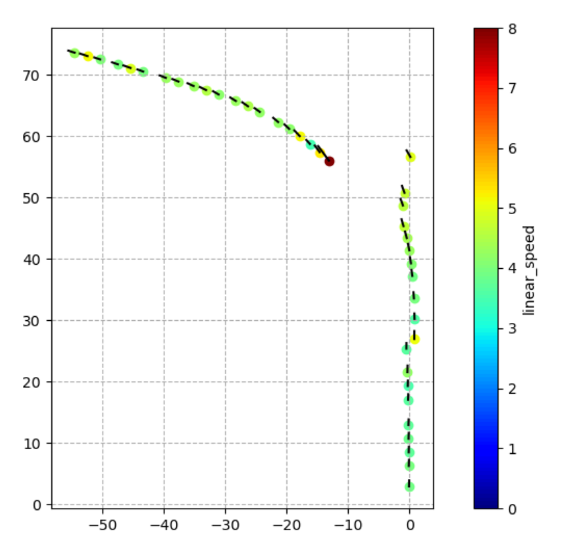
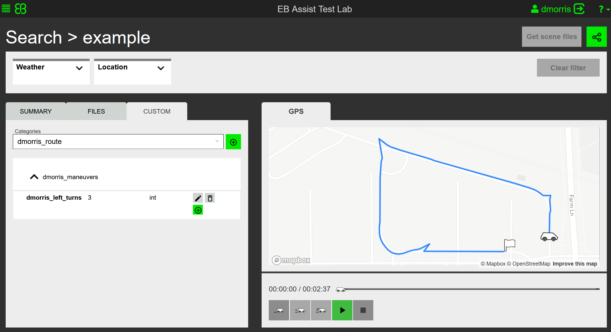

# Lab Assignment 7 - Autonomous Bus Annotation
## ECE-CSE 434

The goal of this lab is to perform analysis and annotation of the Autonomous Bus motion.  This will involve both working with the raw rosbag, and also using the Elektrobit Test Lab Assist software.  

## Accessing Rosbags

Adastec has been collecting rosbags from their bus as it drives along its route on Farm Lane.  They will make them available to us after privacy filters have been run on the imagery to blur or warp face pixels.  In the meantime, they have provided us two rosbags.  These are on the shared drive, and the preferred way to access them is to play them directly from these drives (rather than copying them) as they very large.  You can mount these drives in your VM as follows:

If you are an *ECE* student:
```bash
$ sudo mkdir -p /mnt/t
$ sudo mount -t drvfs '\\cifs\courses\ECE\434\Shared' /mnt/t
```
If you are a *CSE* student:
```bash
$ sudo mkdir -p /mnt/t
$ sudo mount -t drvfs '\\cifs\courses\CSE\434\Shared' /mnt/t
```
Then I recommend you create a symbolic link to the `av_bus` folder with:
```bash
$ cd ~
$ ln -s /mnt/t/av_bus
```
To make sure that the above commands work, have a look in your new `av_bus` folder link:
```bash
$ ls ~/av_bus
av_bus_lot_1_2021-08-09-13-55-50.bag av_bus_lot_1_tf_static.launch av_bus_lot_2_2021-10-17-11-35-56.bag
```
If you do not see the bag files, you may need to resolve your network drive access with DECS.  As long as you are registered for the course you should have access to the shared folder in the network drive.  You can play the bag file as follows:
```bash
$ rosbag play ~/av_bus/av_bus_lot_2_2021-10-17-11-35-56.bag
```

If you are working on a computer that does not have access to the network drives, you can download the bag files from this [link](https://drive.google.com/drive/folders/138jTOVACMFe1fbwqIBk5uz3rP47rDZMk?usp=sharing).  However, note that the current files are 14GB and 28GB, and future files may be even larger.

As more rosbags become available from Adastec, they will be copied into these same locations.

## Python Packages

The provided code uses the `utm` package to convert latitute and longitude to x-y coordinates.  To install this, first activate your python virtual environment and install with:
```bash
$ act work
$ python -m pip install utm
```

### Create a Package
As usual, create a ROS package:
```bash
$ cd ~/catkin_ws/src/<student_repo>
$ catkin_create_pkg lab7_autobus rospy
```
All your code for this assignment should be in this folder `~/catkin_ws/src/<student_repo>/lab7_autobus/src`.  Start by copying the `bus_monitor.py` file from the assignment to this folder.

# Exercise 1

First run the `bus_monitor.py` code as follows:
```bash
$ rosrun lab7_autobus bus_monitor.py
```
Then play the above rosbag.  You will see that this code is a little bit more elaborate AV monitor than `bot_monitor.py` in lab 3.  It converts latitude and longitude to an x-y coordinate system, and plots the bus position in a color dependent on the speed.

Your task is to upgrade this `bus_monitor.py` to add a short black edge that indicates the bus heading and whose length is proportional to the bus speed, as illustrated here:



One way to do this is to add an additional subscriber to the `/gps/imu` topic.  This does not need to be synchronized with the `/gps/fix` topic; it just needs to share data using locks with your plotting function.

Do you notice anything peculiar with the GPS trajectory?   Can you explain it?   An alternative way to plot the bus position and orientation would be using the `TransformFrames` class used in earlier labs.  This would be preferable if a more sophisticated fusion method was used to find the `base_link` of the bus rather than the raw GPS, although I do not believe that is the case for the bus.

# Exercise 2

In this exercise we will ingest some AV Bus data into Elektrobit Test Lab Assist and annotate it.  The 4th video from Tuesday is Jeremy's turtorial on how to ingest and annotate data on Test Lab Assist.  

Note, do **not** upload a large multi-gigabyte rosbag, as we are paying for online Azure storage.  Instead this exercise will upload a pared-down rosbag that contains just the motion data from the AV bus.  

**(a)** Use the `rosbag filter` command to create a rosbag containing just the GPS topics from `av_bus_lot_2_2021-10-17-11-35-56.bag`.  Documentation for this command is here: [http://wiki.ros.org/rosbag/Commandline#filter](http://wiki.ros.org/rosbag/Commandline#filter).  Notice that you can use any Python expression to filter on topic name.  While the input bag is on the network drive, your output bag will need to be in your local ubuntu space, probably your `~/bags` folder, not the network drive.  Set the name of your output bag to be `av_bus_lot_2_<student_netid>.bag` where `<student_netid>` is your MSU NetID.   Finally, when you have created the bag, check the size of your rosbag with the `ls -l` command which gives the number of bytes in a file.  It should be under 6MB.

**(b)** Log into our Test Lab landing-space: [https://msu-testlabwebgui.azurewebsites.net/landing-page](https://msu-testlabwebgui.azurewebsites.net/landing-page) and upload the bag file you created in (a) that has your NetID in its file name.  It may show pending for a while until it uploads.  After it has uploaded, find it in the search menu, click on it and retrieve the Scene ID of it from its URL.  

Next, follow the Colab Jupyter notebook [example](https://colab.research.google.com/drive/1UtLsZCb_KDv4puTYGo0cnWNPyyB1V5yu?usp=sharing#scrollTo=7wEA1T3oNqu6) to add a new annotation that counts the number of left turns the bus takes in the scene.  Since the whole class is using the same landing-page, make sure to distinguish all your annotation and category names by prefixing them with your student ID.  Then every student will have his/her own tags and categories.  The following is a summary of how to add the annotation:

1. In the first block, enter your Scene ID number and then run the block.  This sets a few key parameters including `sceneID`.
2. The second block creates a new tag with its own type.  We want a tag to specify the number of left turns so call it `<student_id>_left_turns`, and make it type `int`.  Then run this block.
3. Run the third block to get the *Label Group ID*.  This is stored in the variable `labelGroupID` and automatically filled in all the following blocks.  This ensures that all your new labels will be assigned to just your scene.
4. In the 4th block you can create a label with a category and name.  We want this to be under the Custom pull-down menu, so first you'll need to fill the `custom_label` ID number in: *Label Group ID*.  To get the `custom_label` ID number use Swagger as described next: 
5. Use Swagger at https://msu-testlabscenerestapi.azurewebsites.net/scene-rest-api/swagger-ui#.  First enter the bearer token (from the Colab page) in the `Authorize` button.  Then scroll down to `Label keys` (not `Label key`) `Get` button, click on the `Try it out` button, and clear the default elements in the form and then click on `Execute`.  This will generate a `curl` command which can be used in Python as well as a list of all the Label Key IDs.  Download this list to a file, which you can open and find the Label Key ID for `custom_label`.  In this file I find that it is `92`.  
6. Return to the 4th block where you can create a category and label name after you have this ID number for the `label_key_ID` entry.  Let the category be `<student_id>_route` and the label be `<student_id>_maneuvers`.  
7. Group 5 shows how you can add a tag value for the tag type you created in step 2 above.  You'll need the `label_key_ID` for this tag, which you can get from swagger as described above -- just search in the output file for the tag name `<student_id>_left_turns` you created in step 2. Fill in the tag's Id in the `label_key_ID` line, and fill its value in the `label_value` line.  Note that the type of the value must agree with the tag type you defined in step 2, in this case an integer.  
8. Now that you have added a tag value to the category \ label in the custom label, return to the EB landing page [https://msu-testlabwebgui.azurewebsites.net/landing-page](https://msu-testlabwebgui.azurewebsites.net/landing-page), search for your scene, and reload it if necessary, and you should see the Custom menu next to Summary and Files.  In this you should see the categories and labels, and find the tag with the value you just assigned it.  The below image shows how the category, label and tag all look for my annotation.
9. See Jeremy's review of adding tags starts at minute 50:49. Jeremy's example of adding a time-stamp starts at 56:45, and then skips to 1:00:55 where he gives an example of adding time-stamp annotations.



