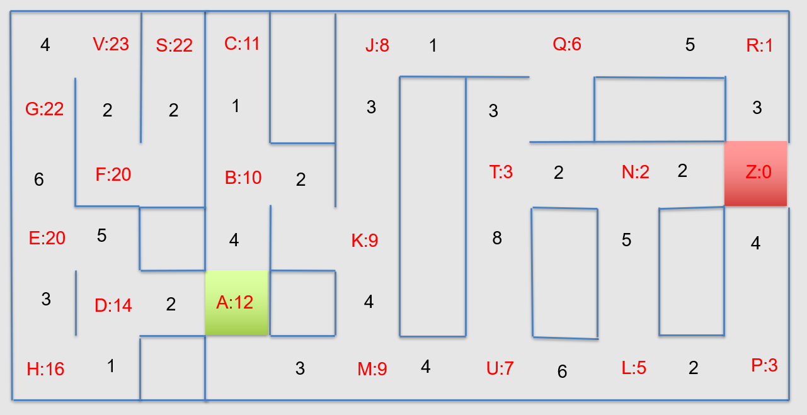

# Lab 9: Path Planning and Navigation
## ECE-CSE 434 - Automated Vehicles

# Preparation

As usual, within your assigned repo folder, `<student_repo>`, create a package for this lab and push this to submit the assignment:
```
cd ~/catkin_ws/src/<student_repo>
catkin_create_pkg lab9_nav rospy
```

# Exercise 1: Graph Search (10 Points)

In this exercise you will be finding the lowest cost path between a pair of nodes in the following map:



Each red letter is a node, and the robot can move along the roadways between nodes but not across the walls.  The black numbers in each roadway are the bi-directional costs of moving between pairs of nodes. The red number in each node is an admissible estimate of the cost to the goal from that node (i.e. never an over-estimate).

(a) Use Dijkstra's Algorithm to solve for the shortest path from node `A` and node `Z`.  As you expand the nodes, complete the table in the file `Dijkstras.csv`. This has 3 columns: `Node`, `D` and `Order`.  Here `D` is the shortest path from to each node from the starting location *as found by Dijkstra's*; only expand nodes if required by Dijkstras, otherwise leave its `D` value as `Inf`. When you are done, indicate the shortest path in the `Order` column, leaving nodes not on the shortest path as `Inf`.  

(b) Use A* to solve for the shortest path from node `A` to node `Z`. As you expand the nodes, complete the table in the file `Astar.csv`, which has 5 columns: `Node`, `D`, `H`, `F`, and `Order`.   Here `H` is the admissible estimate from each node to the goal and has been provided for you.  `D` is the shortest path from to each node from the starting location as found by A*, and `F = D + H` for each node.   Only expand nodes as required by A*, and leave unexplored nodes as `Inf`.  When you are done, indicate the shortest path in the `Order` column, with nodes not on the shortest path left as `Inf`.

# Exercise 2: Pure-Pursuit (10 Points)

In a future lab we will implement a green-line following capability using pure-pursuit.  This exercise develops the pure-pursuit logic but without the camera perception portion.  The task is to drive the robot in a unit square.  In lab 3 you implemented an *open-loop* square driving capablity.  If you recall, it was challenging to get the robot to stay on track, especially at higher speeds.  Here we'll use feedback from the robot's location to enable it to more easily drive in a square.  

Create a ROS node called `square_pursuit.py` that will use Pure-Pursuit to drive on the same unit square as in Lab 3.  It should subscribe to the `odom` topic and publish to the `cmd_vel` topic.  Furthermore, it should have two optional arguments: `--distance` for the look-ahead distance from the robot to a point on the unit square, and `--speed` for the linear speed to drive in.  To run your code, first start Gazebo with:
```
roslaunch turtlebot3_gazebo turtlebot3_empty_world.launch
```
And call your node with:
```
rosrun lab9_nav square_pursuit.py --distance 0.4 --speed 0.2
```
Where you can set whatever values you like for the arguments.  The robot should keep going around and around the square; do not stop.

## What to publish

To control the robot you just need to publish a `Twist` topic to the `cmd_vel` topic with a publisher like this: 
- `rospy.Publisher('cmd_vel', Twist, queue_size=1)`

In addition, to make grading easier you should also create the following publishers:
- `rospy.Publisher('cmd', TwistStamped, queue_size=1)`
  - This publishes the same Twist as you publish to `cmd_vel` but also has a header with the time-stamp. 
- `rospy.Publisher('point_ahead', PointStamped, queue_size=1)` 
  - This publishes the point on the square ahead of the robot that you are using to calculate the pure pursuit trajectory, along with a header.

The header in both of these topics should should be the same header with the same squence ID as the odom message which you use to get the robot position.  Make sure to publish these two additional topics every time you publish the `cmd_vel` topic.


## Some Hints:
* In subscribing to `odom`, it is a good idea to set `queue_size=1`, as it is important to always run on the latest odometry.  
* I created a function that returns a list of the intersection coordinates between the unit square and a circle centered at the robot (x,y) location and with radius equal to the look-ahead distance.
* I used `transform_frames.py` to transform these intersection points into `base_footprint` coordinates.  In `base_footprint` it is straight-forward to select the best intersection point from all the intersections -- put some thought into how to choose this point.  It is also easy to calculate the Pure-Pursuit Twist parameters in `base_footprint` coordinates.

## Some experiments to try:
Once your code works, observe the robot performance as you:
* Reduce and increase the look-ahead distance
* Reduce and increase the speed

Notice how much easier driving in a square is when the robot can measure its position and orientation.


